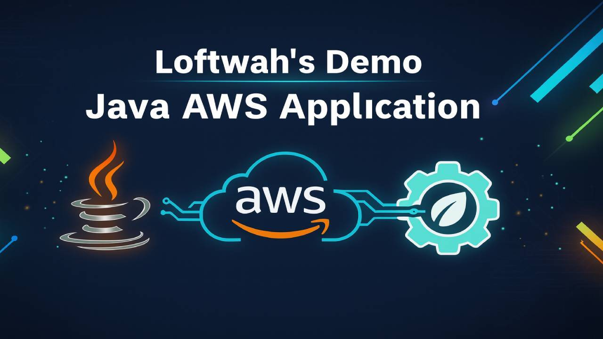

# AWS Labs - Java

> **Purpose:** A single, tool-agnostic **requirements catalogue** capturing all the work you can slice into labs, tickets, or milestones later. No sequencing, no commands, no tooling decisions made for you.

## Scope snapshot

- AWS region `ap-southeast-2` using profile `devops-sandbox`
- Terraform 1.13.0 with S3-backed state (`aws-lab-java-terraform-state` bucket, no DynamoDB locking)
- Default tags: Owner=Dean Lofts, Environment=<env>, Project/App=aws-lab-java, ManagedBy=Terraform
- Deployment targets: ECS Fargate service and EC2 (Docker via Ansible) with shared RDS PostgreSQL
- Terraform stacks under `infrastructure/terraform/stacks/<env>/<stack>` (e.g. `core-networking`) applied independently
- Reference docs: `docs/architecture.md`, `docs/terraform-approach.md`, `docs/state-bootstrap.md`, `docs/demo-application.md`, `docs/local-development.md`

## Lab roadmap

The labs are sequenced in `docs/architecture.md` under _Next steps (labs sequencing)_. Use them to plan Jira tickets or workshop sessions.

---

## Governance & ways of working

**Outcomes to produce**

- Lightweight engineering standards (coding, branching, PRs, change control, docs).
- ADRs for every significant choice (context, options, decision, consequences).
- Named environments with promotion rules and change windows.
- Cross-functional Definition of Done (testing, security checks, observability hooks, docs, rollout plan).

**Evidence of done**

- Standards doc; ADR-0001..N; environment matrix; DoD checklist signed by engineering + ops + stakeholders. ([AWS Documentation][1])

---

## Application (service baseline)

**Outcomes to produce**

- Health contract (readiness + liveness, deterministic semantics).
- Externalised configuration model (env/params/secrets).
- Telemetry contract (minimum app metrics: throughput, latency p95/p99, error %, structured logs; optional traces).
- Backwards-compat policy for APIs and migrations.

**Open decisions**

- Runtime (e.g. Java 21 LTS vs 24) and framework (e.g. Spring Boot/Micronaut/Quarkus/plain).

**Evidence of done**

- Health spec with sample payloads; config key catalogue; metrics/log fields list; compatibility policy. (If Spring Boot, align with Actuator health endpoint.) ([Home][2])

---

## Build & packaging

**Outcomes to produce**

- Reproducible build from a single command yielding deterministic artefacts.
- Versioning scheme (immutable, semver-ish, traceable to commit).
- Container image (if you choose containers): multi-stage, minimal base, baked-in healthcheck, SBOM/provenance captured.

**Open decisions**

- Build tool (Maven/Gradle/other).
- Container vs host-VM deliverable.

**Evidence of done**

- Build plan; versioning rules; artefact manifest; image size budget + base image rationale.

---

## Infrastructure topology

**Outcomes to produce**

- VPC across ≥2 AZs; public subnets for ingress/NAT, private subnets for app/DB.
- Ingress choice (ALB/NLB), listener policy, target health checks mapped to app readiness.
- Runtime choice: **EC2 (ASG + systemd)** or **ECS (Fargate/EC2)** with trade-off table.
- Access model: **SSH-less** by default (Session Manager) with audit trail; bastion optional and justified.
- Centralised secrets/config with KMS and rotation policy.

**Open decisions**

- EC2 vs ECS; TLS/WAF now vs later; domain & certificate strategy.

**Evidence of done**

- Topology diagram; security-group matrix; access model doc; secrets lifecycle; initial cost estimate. ([AWS Documentation][3])

---

## Database (PostgreSQL)

**Outcomes to produce**

- Managed Postgres (e.g. RDS/Aurora) with Multi-AZ, backups/retention, parameter baseline.
- Connectivity policy (SGs, pooling, idle timeouts).
- Observability plan: error/slow logs + **pg_stat_statements** query insight.
- Ops runbooks (restore, failover, schema migration, vacuum/auto-vacuum).

**Open decisions**

- RDS vs Aurora; credential store (SSM vs Secrets Manager).

**Evidence of done**

- DB runbook; log retention; performance guardrails (locks, queue depth, CPU/IO thresholds). ([PostgreSQL][4])

---

## CI (build, test, scan, publish)

**Outcomes to produce**

- PR and main pipelines with clear stages (build, test, scan, publish).
- Federated auth for CI (OIDC) to obtain short-lived cloud credentials; no static keys.
- Quality gates (unit tests, static analysis, dependency/container scans) with thresholds.
- Immutable artefacts in a registry/repository; retention policy; SBOM/provenance.

**Open decisions**

- CI platform (GitHub Actions, GitLab, CodeBuild/CodePipeline, etc.) and scanners.

**Evidence of done**

- Pipeline design doc; gate thresholds; registry retention/provenance policy. ([GitHub Docs][5])

---

## CD (promotion & rollout)

**Outcomes to produce**

- Promotion model using the **same artefact** through environments; approvals for prod.
- Rollout strategy (rolling/blue-green/canary) with automated abort + rollback triggers.
- Post-deploy checks (synthetics + smoke tests); rollback playbook.
- Environment config mapping (vars/params/secrets) with no inline secrets.

**Open decisions**

- Deployer: orchestrator-native vs host-level (e.g. ASG + systemd + SSM).

**Evidence of done**

- Promotion workflow; rollout SLOs; rollback time objective; change log format. ([AWS Documentation][3])

---

## Observability & alerting

**Outcomes to produce**

- Structured logs with correlation IDs; **host log rotation** (size + count) to prevent disk bloat.
- Core metrics (rate/latency/errors/saturation) at app, OS, load balancer, DB layers.
- Optional traces across ingress → app → DB.
- Dashboards per env with ownership; alert catalogue tied to SLOs; escalation path.
- Retention strategy by signal type.

**Open decisions**

- AWS-native only (CloudWatch) vs hybrid/OSS (Grafana, Loki, Tempo, Prometheus).

**Evidence of done**

- Data-flow diagram (logs/metrics/traces), dashboards, alert catalogue, runbooks for the top incidents. ([Docker Documentation][6])

---

## Security

**Outcomes to produce**

- Least-privilege IAM for CI, runtime, and humans; deny-by-default posture.
- No long-lived secrets; federation for CI (OIDC) and temporary creds for humans.
- Edge controls (TLS via ACM; optional WAF) with cipher/header policy.
- Supply-chain policy (base image cadence, dependency controls, provenance).
- Audit trails (CloudTrail/SSM session logs) stored immutably.

**Evidence of done**

- IAM diff (before/after hardening); threat model (DFD + STRIDE); exception register with expiry; audit review notes. ([GitHub Docs][5])

---

## Reliability, DR & resilience

**Outcomes to produce**

- Self-healing behaviour (ASG/Service), failed instance/task eviction tested.
- Backups, restores, and game-day notes with RPO/RTO targets.
- Capacity policies (autoscaling, warm-up, anti-flap).
- Change safety (pre/post checks; optional feature flags).

**Evidence of done**

- DR test report; scaling policy doc; rollback drill timings. ([AWS Documentation][1])

---

## Performance, cost & sustainability

**Outcomes to produce**

- k6 (or similar) profiles: smoke, load, stress, soak; thresholds mapped to SLIs.
- Right-sizing trials (compute + DB), including energy-efficient families where applicable.
- Autoscaling policies (CPU/mem/queue depth) with cool-downs; scheduled off for idle envs.
- Cost visibility (tagging, budgets/alerts); monthly perf–cost review; sustainability notes.

**Evidence of done**

- Performance report with latency/error/cost deltas; action backlog with owners. ([AWS Documentation][1])

---

## Operability & support

**Outcomes to produce**

- Runbooks for the top five incidents (deploy rollback; DB lock storm; 5xx spikes; disk pressure/log growth; access issues).
- Access model including break-glass with auditable, time-bound elevation.
- Change calendar visible to stakeholders; blackout periods honoured.
- Platform one-pager and FAQ for stakeholder/sales/security questionnaires.

**Evidence of done**

- Runbook index; access audit sample; platform one-pager. ([AWS Documentation][1])

---

## JD traceability (short)

- **Infra coordination & environments:** Infrastructure topology, CD, reliability/DR, operability.
- **Monitoring & alerting:** Observability & alerting; performance/cost/sustainability.
- **Builds, releases, deployments:** Build & packaging; CI; CD.
- **Tooling & automation:** Build/CI/CD/observability choices documented and automated.
- **Standards & documentation:** Governance & ways of working; operability & support.
- **Security SME:** Security.
- **PostgreSQL:** Database.

---

## Open decisions to record before building

- Runtime platform (EC2 vs ECS), access model (SSM-only vs bastion + SSM), CI/CD stack, observability stack, Java version, DB flavour, edge controls (TLS/WAF).
  Reference material for common choices: **Well-Architected** for pillars; **Session Manager** for SSH-less access; **OIDC** for short-lived CI creds; **Docker log rotation**; **pg_stat_statements**; **Spring Actuator** for health semantics. ([AWS Documentation][7])

---

## Changes in this version

- **Additions:** Consolidated, tool-agnostic requirements only; JD traceability; explicit “open decisions”.
- **Removals:** No lab numbering, no repo scaffolding, no commands, no sequencing.
- **Modifications:** Title changed to **AWS Labs - Java**; headings de-numbered; Australian English style.

---

## Sources (with credibility)

- **AWS Well-Architected Framework (pillars & guidance)** — _Credibility: High (official)._ ([AWS Documentation][1])
- **AWS Systems Manager Session Manager (SSH-less access & audit)** — _Credibility: High (official)._ ([AWS Documentation][3])
- **GitHub Actions OIDC ↔ AWS (short-lived creds)** — _Credibility: High (official: GitHub + AWS)._ ([GitHub Docs][5])
- **Docker `json-file` driver & rotation** — _Credibility: High (official)._ ([Docker Documentation][8])
- **PostgreSQL `pg_stat_statements`** — _Credibility: High (official)._ ([PostgreSQL][4])
- **Spring Boot Actuator health** — _Credibility: High (official)._ ([Home][2])

---

[1]: https://docs.aws.amazon.com/wellarchitected/latest/framework/welcome.html? "AWS Well-Architected Framework"
[2]: https://docs.spring.io/spring-boot/reference/actuator/endpoints.html? "Endpoints :: Spring Boot"
[3]: https://docs.aws.amazon.com/systems-manager/latest/userguide/session-manager.html? "AWS Systems Manager Session Manager"
[4]: https://www.postgresql.org/docs/current/pgstatstatements.html? "PostgreSQL: Documentation: 17: F.30. pg_stat_statements — track ..."
[5]: https://docs.github.com/en/actions/how-tos/secure-your-work/security-harden-deployments/oidc-in-aws?apiVersion=2022-11-28& "Configuring OpenID Connect in Amazon Web Services - GitHub Docs"
[6]: https://docs.docker.com/engine/logging/configure/? "Configure logging drivers | Docker Docs"
[7]: https://docs.aws.amazon.com/wellarchitected/2024-06-27/framework/the-pillars-of-the-framework.html? "The pillars of the framework - AWS Well-Architected Framework"
[8]: https://docs.docker.com/engine/logging/drivers/json-file/? "JSON File logging driver | Docker Docs"
